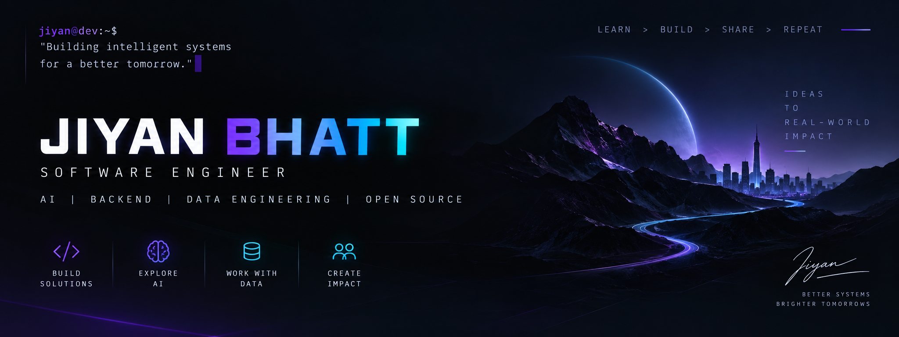

  

<h1 align="center">Hi 👋 I'm Jiyan Bhatt</h1>

<h3 align="center">Software Engineer • AI • Backend • Data Engineering</h3>

  

  Building intelligent systems that bridge AI research and production software engineering.

## 🚀 Currently Building

### Enterprise AI Knowledge Lakehouse (AKL)

Production-scale AI knowledge platform built with a Bronze/Silver/Gold Lakehouse architecture featuring:

* Hybrid RAG Retrieval
* FastAPI backend
* Airflow orchestration
* PostgreSQL + DuckDB
* Qdrant Vector Database
* MLflow + Prometheus + Grafana
* Docker deployment

---

## 💻 Tech Stack

---

## 📊 GitHub Analytics

  
  

  

---

## 🌱 Current Focus

* AI Infrastructure
* Retrieval-Augmented Generation (RAG)
* Backend Systems
* Data Engineering Pipelines
* Open Source Engineering

---

## 📌 Featured Projects

| Project                         | Description                                                                |
| ------------------------------- | -------------------------------------------------------------------------- |
| **AKL**                         | Enterprise AI Knowledge Lakehouse with hybrid retrieval and observability. |
| **MovieMate**                   | Personalized movie recommendation engine using content similarity.         |
| **Dawg Recommender**            | AI-powered recommendation platform.                                        |
| **Expense Tracker**             | Hackathon full-stack finance application.                                  |
| **Fashion Item Classification** | CNN image classification using LeNet on Fashion-MNIST.                     |

---

## 📫 Connect

* LinkedIn: linkedin.com/in/jiyanbhatt
* GitHub: github.com/jiyan2110
* Email: [jiyan.bhatt@gmail.com](mailto:jiyan.bhatt@gmail.com)
